<p align="center">
  
</p>

# Open RAN Agent


Open RAN Agent is a design-first repository for a **5G SA RAN control and operations architecture** centered on **CU-CP**, **CU-UP**, **DU-high**, **split 7.2x southbound integration**, a **native low-PHY / fronthaul runtime boundary**, and **deterministic operations through `bin/ranctl`**. The current phase hardens production-facing control, deploy, evidence, and recovery workflows while keeping runtime expansion and broader interoperability claims explicit and bounded.

> **Status**  
> This repository is intentionally **architecture-first**. It already exposes
> reviewable production-facing operator flows for deploy, evidence, and
> recovery, plus evidence-backed runtime lanes for the declared
> `n79_single_ru_single_ue_lab_v1` live-lab profile and the bounded
> clean-room `Aerial` / `cuMAC` support paths. Vendor-backed integrations,
> broader profile parity, and full RT datapaths remain future work until they
> have repo-visible proof.

**Jump to:** [Why this repo](#why-this-repo) · [Architecture](#architecture-at-a-glance) · [What works today](#what-works-today) · [Hardened now vs future lanes](#hardened-now-vs-future-lanes) · [Getting started](#getting-started) · [Project layout](#project-layout) · [Advanced workflows](#advanced-workflows) · [Roadmap](#roadmap)

## Why this repo

This project exists to make early Open RAN system work more explicit, testable, and operable.

- **Clear ownership boundaries** between BEAM-based control/orchestration and native runtime paths.
- **Deterministic operator workflows** through a single mutable control surface: `bin/ranctl`.
- **Inspectable artifacts and evidence** for `precheck`, `plan`, `apply`, `verify`, `rollback`, and debug workflows.
- **Backend portability** through a canonical FAPI-oriented IR rather than backend-specific control logic.
- **Honest design posture**: assumptions, open questions, and deferred decisions are recorded directly instead of being hidden in ad hoc code.

This is a good fit for contributors interested in **RAN architecture**, **BEAM supervision and fault isolation**, **operational tooling**, and **southbound integration boundaries**.

## Architecture at a glance



<sub>Figure source: [docs/assets/infographics/architecture-overview.infographic](docs/assets/infographics/architecture-overview.infographic)</sub>

### Core design principles

1. Use a **Mix umbrella** as the repo backbone so BEAM applications share tooling, config, and release conventions.
2. Keep **BEAM responsible for control, orchestration, state management, and fault isolation**.
3. Push **slot-timed and fronthaul-adjacent work** behind a native gateway boundary, starting with a Port-based sidecar.
4. Normalize DU-high southbound traffic through a **canonical FAPI-oriented IR** so local and Aerial-style backends share one contract.
5. Treat **`bin/ranctl` as the only mutable action entrypoint** for operational changes.
6. Keep **Symphony, Codex, and skill workflows outside hot paths**. They may propose or orchestrate actions, but they do not directly own runtime state transitions.
7. Design for **single DU / single cell / single UE attach-plus-ping first**, while keeping extension points for Aerial, cuMAC, and multi-cell work.
8. Record **assumptions, open questions, and deferred decisions explicitly**.

<details>
<summary><strong>Selected implementation decisions</strong></summary>

- **Build structure:** Mix umbrella with selective Erlang modules inside apps and native sidecars for RT-sensitive work
- **Language split:** Elixir is the default for app boundaries, supervision, config, and ops layers; Erlang is reserved for protocol-heavy modules where it later proves advantageous
- **BEAM versus native boundary:** `ran_du_high` talks to `ran_fapi_core`; `fapi_rt_gateway` handles backend transport and timing-sensitive bridging
- **Canonical southbound contract:** `slot_batch`-oriented IR with backend capability negotiation and explicit health states
- **Scheduler abstraction:** `ran_scheduler_host` owns the scheduler boundary; `cpu_scheduler` is the default implementation and `cumac_scheduler` remains a future adapter
- **Failure domains:** isolate `association`, `ue subtree`, `cell_group`, and `backend gateway`
- **Automation model:** Symphony and Codex orchestrate skills; skills stay thin wrappers around `bin/ranctl`; MCP is out of scope

</details>

## What works today

| Area | Status | Notes |
| --- | --- | --- |
| Architecture docs and ADRs | ✅ | System overview and design decisions are first-class repository content |
| `ranctl` control lifecycle | ✅ | `precheck -> plan -> apply -> verify -> rollback` with file-backed outputs |
| Production-facing control / evidence / recovery loop | ✅ | Approval, rollback intent, target-host deploy, remote `ranctl`, fetchback, and debug evidence are explicit and reviewable |
| Dashboard / Deploy Studio | ✅ | Local UI for topology preview, actions, readiness, and evidence |
| OAI DU runtime bridge | ✅ | Real OpenAirInterface DU orchestration via generated Docker Compose assets |
| Source bundle packaging | ✅ | Source-first bundle generation and stricter topology validation |
| Target-host deploy chain | ✅ | Ship, preflight, remote `ranctl`, and evidence fetch workflows |
| Native runtime boundary | ✅ | Shared Port-backed gateway runtime, strict host-probe gating, and bounded clean-room `Aerial` support are reviewable now |
| Scheduler boundary | ✅ | `cpu_scheduler` and bounded clean-room `cumac_scheduler` support are explicit, replayable, and cell-group scoped |
| End-to-end live protocol stacks | ⚠️ | The declared `n79_single_ru_single_ue_lab_v1` lane has real-lab lifecycle and attach/session/ping proof; broader protocol and profile parity remain future work |

## Evidence-backed runtime lanes

The current support split is deliberate and evidence-backed:

- **Operator and evidence surfaces are hardened now:** `ranctl` control
  lifecycle, target-host deploy and fetchback, reviewable debug/evidence
  artifacts, and replacement-track contract/evidence schemas.
- **Runtime lanes with repo-visible proof are explicit and reviewable:**
  - `Declared live protocol lane`: the repo now carries real-lab lifecycle,
    attach, registration, PDU session, ping, and rollback evidence for
    `n79_single_ru_single_ue_lab_v1`.
  - `Aerial clean-room runtime`: `aerial_fapi_profile` now carries bounded
    clean-room runtime support for `aerial_clean_room_runtime_v1`, including
    strict host probes plus health, drain, resume, and restart evidence.
  - `cuMAC clean-room scheduler`: `cumac_scheduler` now carries bounded
    clean-room scheduler support for
    `cumac_scheduler_clean_room_runtime_v1`, including executable slot-plan
    proof, explicit CPU rollback target metadata, and cell-group failure-domain
    boundaries.
- **Future expansion lanes remain explicit and reviewable:**
  - vendor-backed `Aerial` device bring-up and attach validation
  - external `cuMAC` worker ownership and timing guarantees
  - broader profile expansion beyond the declared single-DU, single-cell,
    single-UE lane, including multi-cell, multi-DU, multi-UE, and mobility,
    decomposed under `YON-66`

Use [docs/architecture/15-production-control-evidence-and-interoperability-lanes.md](docs/architecture/15-production-control-evidence-and-interoperability-lanes.md) for the parent-level posture map that ties those categories together.

## Deliberately not production-complete yet

The current phase does **not** aim to deliver a complete production RAN stack. The following remain explicitly deferred for now:

- live ASN.1 codecs beyond the declared `n79` proof lane
- SCTP and GTP-U runtime stacks beyond the declared `n79` proof lane
- real eCPRI or O-RAN FH transport
- real local DU-low implementation
- vendor-backed NVIDIA Aerial integration
- external-worker cuMAC integration
- broader profile expansion beyond the declared single-DU, single-cell, single-UE bootstrap lane
- production Symphony hooks

## Getting started

### 1) Read the architecture in the right order

| Goal | Start here |
| --- | --- |
| Understand the full system boundary | [docs/architecture/00-system-overview.md](docs/architecture/00-system-overview.md) |
| Understand the mutable action model | [docs/architecture/05-ranctl-action-model.md](docs/architecture/05-ranctl-action-model.md) |
| Understand the OAI runtime bridge | [docs/architecture/09-oai-du-runtime-bridge.md](docs/architecture/09-oai-du-runtime-bridge.md) |
| Understand target-host deployment | [docs/architecture/12-target-host-deployment.md](docs/architecture/12-target-host-deployment.md) |
| Understand ops profiles | [docs/architecture/13-ocudu-inspired-ops-profiles.md](docs/architecture/13-ocudu-inspired-ops-profiles.md) |
| Understand debugging and evidence | [docs/architecture/14-debug-and-evidence-workflow.md](docs/architecture/14-debug-and-evidence-workflow.md) |
| Understand current support posture | [docs/architecture/15-production-control-evidence-and-interoperability-lanes.md](docs/architecture/15-production-control-evidence-and-interoperability-lanes.md) |

Read ADRs in order under [docs/adr](docs/adr). Use [AGENTS.md](AGENTS.md) for persistent repository rules.

### 2) Try the control surface



<sub>Figure source: [docs/assets/infographics/ranctl-lifecycle.infographic](docs/assets/infographics/ranctl-lifecycle.infographic)</sub>

A minimal example:

```bash
bin/ranctl plan --file examples/ranctl/precheck-switch-local.json
```

Useful first commands:

```bash
# local design / contract checks
mix contract_ci

# open the local operator UI
bin/ran-dashboard

# exercise the control lifecycle
bin/ranctl precheck --file examples/ranctl/precheck-oai-du-docker.json
bin/ranctl plan --file examples/ranctl/apply-oai-du-docker.json

# exercise the core cutover control surface
bin/ranctl precheck --file examples/ranctl/core/precheck-core-cutover-scp.json
bin/ranctl plan --file examples/ranctl/core/plan-core-cutover-scp.json
```

Core `ranctl` request examples now live under [examples/ranctl/core](/home/mud/repo/open_ran_agent/examples/ranctl/core) for the current `NRF` and `SCP` pilot lanes, gated `AMF` planning, and `NRF` shadow verification.

### 3) Know what the current validation already covers

- `ranctl` lifecycle, approval handling, and config-aware prechecks
- `ran_du_high -> ran_scheduler_host -> ran_fapi_core -> stub backend`
- controlled failover policy based on configured `backend` and `failover_targets`
- reusable switch/rollback integration harness in `ran_test_support`
- OAI DU runtime orchestration through generated Docker Compose assets and mocked Docker lifecycle checks
- replacement-track schema validation for status, compare-report, rollback-evidence, and target-profile fixtures
- thin skill wrapper scripts under `ops/skills/*/scripts/run.sh`
- native boundary placeholders such as `native/fapi_rt_gateway/PORT_PROTOCOL.md`

## Project layout

| Path | Purpose |
| --- | --- |
| `bin/` | Operator entrypoints such as `ranctl`, `ran-dashboard`, `ran-install`, and remote deploy helpers |
| `apps/` | BEAM umbrella applications for core control, CU/DU layers, config, observability, and test support |
| `native/` | RT-sensitive gateway and backend adapter boundaries |
| `docs/architecture/` | System walkthroughs and design documents |
| `docs/assets/` | README figures, logo assets, infographic source, and preview render assets |
| `docs/adr/` | Architectural decision records |
| `config/` | Runtime config, environment profiles, and example topologies |
| `ops/` | Deploy scripts, skills, and Symphony-facing integration assets |
| `scripts/` | Regeneration helpers such as README figure export |
| `subprojects/` | Design-first side workspaces such as the clean-room `elixir_core/` 5GC exploration track |
| `examples/` | Example `ranctl` requests, incidents, and operator/design references |
| `AGENTS.md` | Persistent repository rules |

<details>
<summary><strong>Full proposed tree</strong></summary>

```text
.
|-- AGENTS.md
|-- README.md
|-- bin/
|   |-- ran-debug-latest
|   |-- ran-install
|   |-- ranctl
|   |-- ran-dashboard
|   |-- ran-deploy-wizard
|   |-- ran-fetch-remote-artifacts
|   |-- ran-ship-bundle
|   |-- ran-remote-ranctl
|   `-- ran-host-preflight
|-- config/
|   |-- config.exs
|   |-- runtime.exs
|   |-- dev/
|   |   |-- README.md
|   |   `-- single_cell_local.exs.example
|   |-- lab/
|   |   |-- README.md
|   |   `-- single_cell_stub.exs.example
|   `-- prod/
|       |-- README.md
|       `-- controlled_failover.exs.example
|-- docs/
|   |-- assets/
|   |-- adr/
|   `-- architecture/
|-- apps/
|   |-- ran_core/
|   |-- ran_cu_cp/
|   |-- ran_cu_up/
|   |-- ran_du_high/
|   |-- ran_fapi_core/
|   |-- ran_scheduler_host/
|   |-- ran_action_gateway/
|   |-- ran_observability/
|   |-- ran_config/
|   `-- ran_test_support/
|-- native/
|   |-- fapi_rt_gateway/
|   |-- local_du_low_adapter/
|   `-- aerial_adapter/
|-- ops/
|   |-- deploy/
|   |-- skills/
|   `-- symphony/
|-- scripts/
`-- examples/
    |-- incidents/
    `-- ranctl/
```

</details>

## Advanced workflows



<sub>Figure source: [docs/assets/infographics/target-host-deploy.infographic](docs/assets/infographics/target-host-deploy.infographic)</sub>

<details>
<summary><strong>Dashboard and Deploy Studio</strong></summary>

`bin/ran-dashboard` starts a Symphony-style local dashboard for the repo's live RAN and agent surface.

- `http://127.0.0.1:4050/` serves the UI
- `http://127.0.0.1:4050/api/dashboard` returns the unified snapshot JSON
- `http://127.0.0.1:4050/api/health` returns the server health probe
- `http://127.0.0.1:4050/api/actions/run` accepts dashboard-triggered `ranctl` actions
- `http://127.0.0.1:4050/api/deploy/defaults` returns safe repo-local deploy defaults
- `http://127.0.0.1:4050/api/deploy/run` drives Deploy Studio preview and preflight runs

The dashboard pulls together:

- configured cell groups and backend policy from `ran_config`
- live Docker runtime state for OAI, DU split, UE, FlexRIC, xApps, and support services
- recent `plan/apply/verify/rollback/capture-artifacts` outputs from `artifacts/*`
- available operator skills from `ops/skills/*`
- target-host deploy preview state, rendered topology/request/env files, and preflight output
- deploy profile selection plus exported `deploy.profile.json` and `deploy.effective.json`
- exported `deploy.readiness.json` with rollout score, blockers, warnings, and recommendation
- remote handoff commands for `scp/ssh/install/preflight`
- recent remote host transcripts and fetched evidence under `artifacts/remote_runs/*`
- latest failed deploy or remote run with debug-pack pointers

The dashboard can trigger a subset of `ranctl` commands directly from the UI:

- `observe`
- `precheck`
- `plan`
- `apply`
- `rollback`
- `capture-artifacts`

`Deploy Studio` stages target-host files into `artifacts/deploy_preview/*` by default, previews rendered files before touching `/etc/open-ran-agent`, runs the same preflight path as `bin/ran-deploy-wizard`, exports `deploy.profile.json` and `deploy.effective.json`, computes `deploy.readiness.json`, generates remote handoff commands once `target_host` is set, and surfaces the latest remote `ranctl` transcripts plus fetched evidence bundles.

It also exposes a `Debug Desk` view of the latest failed install or remote run and the corresponding `debug-summary.txt` and `debug-pack.txt` artifacts.

</details>

<details>
<summary><strong>Easy install and debug quickstart</strong></summary>

`bin/ran-install` is the shortest deploy entrypoint.

```bash
bin/ran-debug-latest --failures-only
bin/ran-install
bin/ran-install --target-host ran-lab-01
bin/ran-install --target-host ran-lab-01 --apply --remote-precheck
```

The command will:

- reuse the latest packaged bundle or build one if none exists
- generate safe preview files through `bin/ran-deploy-wizard`
- export `deploy.profile.json`, `deploy.effective.json`, and `deploy.readiness.json`
- write quickstart artifacts under `artifacts/deploy_preview/quick_install/*`
- write `debug-summary.txt` and `debug-pack.txt` beside each quick-install, ship, or remote run
- optionally execute remote ship plus remote `ranctl precheck`
- refuse `--apply` unless readiness is cleared, unless `--force` is set

If an operator only needs the shortest failure-to-evidence path:

```bash
bin/ran-debug-latest --failures-only
bin/ran-install --target-host ran-lab-01
RAN_REMOTE_APPLY=1 bin/ran-remote-ranctl ran-lab-01 precheck ./artifacts/deploy_preview/etc/requests/precheck-target-host.json
```

Read debug evidence in this order:

1. [docs/architecture/14-debug-and-evidence-workflow.md](docs/architecture/14-debug-and-evidence-workflow.md)
2. `debug-pack.txt`
3. `debug-summary.txt`
4. `transcript.log` or `command.log`
5. fetched `result.jsonl` or `fetch/extracted/*`

</details>

<details>
<summary><strong>CI, packaging, and artifact hygiene</strong></summary>

Use the shared local CI contract before pushing changes:

```bash
mix contract_ci
mix runtime_ci
mix ci
npm run docs:build
```

- `mix contract_ci` is the fast design and contract gate
- `mix runtime_ci` runs the tagged runtime smoke path and bootstrap packaging smoke
- `mix ci` runs both
- GitHub Actions mirrors the same split in `.github/workflows/ci.yml`
- `npm run docs:build` builds the VitePress docs site intended for Cloudflare Pages

GitHub Actions also uploads:

- architecture docs and ADR snapshot from the contract job
- `artifacts/releases/ci-smoke/**` plus runtime smoke artifacts from the runtime job

Docs-site deployment is intentionally separate. The recommended production path is **Cloudflare Pages Git integration**, while GitHub Actions keeps a docs-only validation workflow in [`.github/workflows/docs-site.yml`](.github/workflows/docs-site.yml). Use `npm ci && npm run docs:build` as the Pages build command and `docs/.vitepress/dist` as the output directory.

The repo ships a source-first bootstrap bundle for lab-host style distribution:

```bash
mix ran.package_bootstrap
mix package_bootstrap
```

The packaging command writes:

- `artifacts/releases/<bundle_id>/manifest.json`
- `artifacts/releases/<bundle_id>/open_ran_agent-<bundle_id>.tar.gz`

Packaging is stricter than normal bootstrap validation. It rejects topologies that do not declare controlled failover targets for each `cell_group`.

Artifact cleanup is explicit and dry-run first:

```bash
mix ran.prune_artifacts
mix prune_artifacts
mix ran.prune_artifacts --apply
```

The planner keeps recent JSON refs, recent runtime dirs, and recent release bundles, while protecting `artifacts/control_state/*` by default.

</details>

<details>
<summary><strong>Topology override and control-state workflows</strong></summary>

The repo can load a single-DU lab topology from `RAN_TOPOLOGY_FILE` before `ranctl` or the dashboard starts.

```bash
RAN_TOPOLOGY_FILE=config/lab/topology.single_du.rfsim.json bin/ranctl precheck --file examples/ranctl/precheck-oai-du-docker.json
RAN_TOPOLOGY_FILE=config/lab/topology.single_du.rfsim.json bin/ran-dashboard
```

The loaded topology path is surfaced in the dashboard snapshot and validation report.

`ranctl` also supports lightweight attach-freeze and drain coordination through `metadata.control`.

```bash
bin/ranctl plan --file examples/ranctl/apply-freeze-attaches.json
bin/ranctl apply --file examples/ranctl/apply-freeze-attaches.json

bin/ranctl plan --file examples/ranctl/apply-drain-cell-group.json
bin/ranctl apply --file examples/ranctl/apply-drain-cell-group.json
bin/ranctl observe --file examples/ranctl/apply-drain-cell-group.json
bin/ranctl rollback --file examples/ranctl/rollback-drain-cell-group.json
```

`capture-artifacts` writes config and control snapshots alongside the main capture bundle.

</details>

<details>
<summary><strong>OAI DU runtime bridge</strong></summary>

The repo includes an executable bridge from `ranctl` to a real OpenAirInterface DU runtime:

- runtime spec comes from `metadata.oai_runtime` and optional `cell_group` defaults
- optional repo-local UE/core/session rehearsal proof comes from `metadata.oai_simulation`
- `plan` renders `artifacts/runtime/<change_id>/docker-compose.yml`
- `plan` also renders patched overlay confs under `artifacts/runtime/<change_id>/conf/*.conf`
- `apply` brings up `CUCP + CUUP + DU` in RFsim F1 split mode, and also launches `OAI NR UE` when `metadata.oai_runtime.ue_conf_path` is present
- `precheck` validates split markers and required patch points in the source confs, plus optional UE image/conf `/dev/net/tun` and simulation evidence prerequisites
- `verify` inspects container state, captures log tails, accepts steady-state DU activity for long-running containers, records UE log/tunnel evidence when the UE lane is enabled, and can surface repo-local simulated UE attach, registration, session, and ping evidence
- `capture-artifacts` bundles the rendered runtime assets, container logs, and any declared simulation evidence refs
- `rollback` tears the stack down deterministically

Example flow:

```bash
bin/ranctl precheck --file examples/ranctl/precheck-oai-du-docker.json
bin/ranctl plan --file examples/ranctl/apply-oai-du-docker.json
bin/ranctl apply --file examples/ranctl/apply-oai-du-docker.json
bin/ranctl verify --file examples/ranctl/verify-oai-du-docker.json
bin/ranctl capture-artifacts --file examples/ranctl/verify-oai-du-docker.json
bin/ranctl rollback --file examples/ranctl/rollback-oai-du-docker.json
```

The public example requests now point at repo-local split OAI conf fixtures under `examples/oai/` and repo-local simulation evidence under `examples/oai/simulation/`, so the documented `precheck -> plan -> apply -> verify -> capture-artifacts -> rollback` lane works from the checkout without requiring `/opt/openairinterface5g`.

Repo-local split + UE flow from the repo root:

```bash
bin/ranctl precheck --file examples/ranctl/precheck-oai-du-ue-repo-local.json
bin/ranctl plan --file examples/ranctl/apply-oai-du-ue-repo-local.json
bin/ranctl apply --file examples/ranctl/apply-oai-du-ue-repo-local.json
bin/ranctl verify --file examples/ranctl/verify-oai-du-ue-repo-local.json
bin/ranctl rollback --file examples/ranctl/rollback-oai-du-ue-repo-local.json
```

To run against your own OAI conf set, replace the three `*_conf_path` fields in `examples/ranctl/apply-oai-du-docker-template.json` and reuse the same metadata for `precheck`, `plan`, `apply`, and `verify`. Add `metadata.oai_runtime.ue_conf_path` when you want the bounded UE bringup lane, and keep `metadata.oai_simulation` only for simulation-only proof; it is intentionally not a live-lab claim.

See [docs/architecture/09-oai-du-runtime-bridge.md](docs/architecture/09-oai-du-runtime-bridge.md) for the current scope and limitations.

</details>

<details>
<summary><strong>Target-host deploy</strong></summary>

The bootstrap bundle carries a target-host install and preflight chain:

- `ops/deploy/install_bundle.sh`
- `ops/deploy/ship_bundle.sh`
- `ops/deploy/run_remote_ranctl.sh`
- `ops/deploy/preflight.sh`
- `bin/ran-deploy-wizard`
- `bin/ran-fetch-remote-artifacts`
- `bin/ran-ship-bundle`
- `bin/ran-remote-ranctl`
- `bin/ran-host-preflight`
- `ops/deploy/systemd/ran-dashboard.service`
- `ops/deploy/systemd/ran-host-preflight.service`
- `config/prod/topology.single_du.target_host.rfsim.json.example`
- `examples/ranctl/precheck-target-host.json.example`

Target-host staging is profile-driven. `bin/ran-deploy-wizard` and `Deploy Studio` can render:

- `deploy.profile.json`
- `deploy.effective.json`

Available deploy profiles:

- `stable_ops`
- `troubleshoot`
- `lab_attach`

Typical flow:

```bash
mix ran.package_bootstrap --bundle-id target-host-smoke
./artifacts/releases/target-host-smoke/install_bundle.sh ./artifacts/releases/target-host-smoke/open_ran_agent-target-host-smoke.tar.gz /opt/open-ran-agent
/opt/open-ran-agent/current/bin/ran-deploy-wizard --skip-install
/opt/open-ran-agent/current/bin/ran-host-preflight
```

Or start `bin/ran-dashboard` and use `Deploy Studio` to generate the same topology, request, and env files into a safe repo-local preview root before moving them to the live host.

For remote handoff from the packaging host:

```bash
bin/ran-deploy-wizard --defaults --safe-preview --skip-install --target-host ran-lab-01
bin/ran-ship-bundle ./artifacts/releases/target-host-smoke/open_ran_agent-target-host-smoke.tar.gz ran-lab-01
RAN_REMOTE_APPLY=1 bin/ran-ship-bundle ./artifacts/releases/target-host-smoke/open_ran_agent-target-host-smoke.tar.gz ran-lab-01
RAN_REMOTE_APPLY=1 bin/ran-remote-ranctl ran-lab-01 precheck ./artifacts/deploy_preview/etc/requests/precheck-target-host.json
RAN_REMOTE_APPLY=1 bin/ran-fetch-remote-artifacts ran-lab-01 ./artifacts/deploy_preview/etc/requests/precheck-target-host.json
```

If `artifacts/deploy_preview/etc` exists, `bin/ran-ship-bundle` syncs the rendered topology, request, and env files to the remote host before running preflight. `bin/ran-remote-ranctl` also auto-fetches matching remote evidence into `artifacts/remote_runs/*/fetch` unless `RAN_REMOTE_FETCH=0` is set, and `bin/ran-fetch-remote-artifacts` can re-sync the same evidence later on demand.

See [docs/architecture/12-target-host-deployment.md](docs/architecture/12-target-host-deployment.md), [ops/deploy/README.md](ops/deploy/README.md), and [docs/architecture/13-ocudu-inspired-ops-profiles.md](docs/architecture/13-ocudu-inspired-ops-profiles.md).

</details>

## Open-source collaboration

This repository is prepared for public collaboration.

- license: [MIT](LICENSE)
- contribution guide: [CONTRIBUTING.md](CONTRIBUTING.md)
- security reporting: [SECURITY.md](SECURITY.md)
- only sanitized examples and templates belong in the repo
- private lab configs, generated artifacts, local crash dumps, and operator-specific OAI or srsRAN settings are intentionally ignored

If you maintain local lab files such as `OAI_config_WE_flexric.conf`, `srsran_config.yml`, or private OAI UE and gNB configs, keep them outside git or under ignored local-only filenames.

## Scope

### In scope now

- architecture documentation
- repo skeleton
- initial BEAM app boundaries
- canonical interfaces and stub modules
- operations workflow skeleton
- config examples
- backlog definition
- executable contract-only `ranctl` flow with file-backed plan, state, verify, and capture outputs
- end-to-end `stub_fapi_profile` path for boundary validation

### Explicitly deferred

- live ASN.1 codecs
- SCTP and GTP-U runtime stacks
- real eCPRI or O-RAN FH transport
- real local DU-low implementation
- real NVIDIA Aerial integration
- real cuMAC integration
- production Symphony hooks

## Assumptions

- SA-only deployment is sufficient for the MVP.
- One DU, one cell group, and one UE path are enough to shape the initial contracts.
- RU-side low-PHY exists outside the BEAM core.
- Aerial-style contract paths can be represented through backend capabilities and profile selection without claiming proven Aerial interoperability today.

## Roadmap

1. Fill in real app internals behind the current behaviours and structs.
2. Harden `bin/ranctl` from a bootstrap executor toward a release-aware runtime entrypoint.
3. Replace contract-only backend paths with real gateway-backed session paths.
4. Extend integration tests for backend switching, rollback, artifact capture, and target-host flows.
5. Ship compiled release and container packaging for target hosts.

Roadmap-only interoperability lanes:

- `Aerial interoperability`: current hardened-now support stops at `aerial_fapi_profile` contract scaffolding, session lifecycle scaffolds, and host-probe gating. Promotion to a real interoperability claim is tracked in `YON-58`.
- `cuMAC scheduler interoperability`: current hardened-now support stops at the `ran_scheduler_host` boundary and placeholder `cumac_scheduler` adapter surface. Promotion to a real interoperability claim is tracked in `YON-59`.
- `Broader profile expansion`: current hardened-now support stops at the declared single-DU, single-cell, single-UE bootstrap lane and contract-only backend surfaces. Expansion to multi-cell, multi-DU, multi-UE, mobility, or broader vendor/profile coverage is decomposed under `YON-66`.

## License

Released under the [MIT License](LICENSE).
