# System Overview

## Purpose

This repository defines the control, orchestration, and operations architecture for a 5G SA Open RAN stack that covers CU-CP, CU-UP, and DU-high while preserving a strict native boundary for timing-sensitive southbound work.

## MVP Goal

The first meaningful target is:

- one DU
- one cell group
- one UE
- attach plus ping
- controlled backend failover between pre-provisioned targets

## System Shape

Figure source: [../assets/infographics/architecture/00-system-overview.infographic](../assets/infographics/architecture/00-system-overview.infographic)

## Major Boundaries

- BEAM core: topology, state machines, failure handling, orchestration, config, observability.
- Native gateway: slot-paced and backend-specific RT-adjacent transport.
- Backend adapters: `local_du_low`, `aerial_backend`, and `stub_fapi_profile`.
- Ops plane: `ranctl`, skills, and Symphony/Codex workflows.

## Architecture Choices

- Use Mix umbrella so multiple OTP applications share one repository and one release discipline.
- Standardize southbound traffic on a canonical IR to prevent backend-specific leakage into DU-high logic.
- Keep scheduler logic behind a host boundary so CPU and future cuMAC schedulers are swappable.
- Use `precheck -> plan -> apply -> verify -> rollback` for all mutating operations.

## Assumptions

- RU-side low-PHY remains external to BEAM-managed code.
- FAPI-like semantics are sufficient for DU-high to native gateway exchange.
- Backend switching is limited to pre-provisioned targets, not ad hoc shell-level failover.

## Deferred Decisions

- exact ASN.1 and NGAP/F1AP/E1AP codec strategy
- exact transport libraries for SCTP and GTP-U
- real DU-low and Aerial runtime implementations

Roadmap note:

These future interoperability lanes remain in the roadmap-only set until they
are explicitly proven.

- Hardened-now support stops at the single-DU, single-cell, single-UE bootstrap
  lane plus contract-level backend and scheduler surfaces.
- `Aerial interoperability` remains roadmap-only until the `aerial_backend`
  lane has real external proof. Track promotion work in `YON-58`.
- `cuMAC scheduler interoperability` remains roadmap-only until the
  `cumac_scheduler` lane has real external proof. Track promotion work in
  `YON-59`.
- `Broader profile expansion` remains roadmap-only until any multi-cell,
  multi-DU, multi-UE, mobility, or broader vendor/profile lane is separately
  proven. Track that decomposition in `YON-66`.
