# Context And Boundaries

## External Context

Figure source: [../assets/infographics/architecture/01-context-and-boundaries.infographic](../assets/infographics/architecture/01-context-and-boundaries.infographic)

## Boundary Rules

- `ran_cu_cp`, `ran_cu_up`, and `ran_du_high` may coordinate through `ran_core` services, but they must not directly manage native timing loops.
- `ran_du_high` only speaks canonical IR through `ran_fapi_core`.
- `ran_fapi_core` owns contract translation, profile selection, and capability negotiation.
- `fapi_rt_gateway` owns backend-specific transport and process supervision outside the BEAM scheduler.
- Skills never apply shell-level mutations directly when `ranctl` can express the action.

## Southbound Profiles

- `stub_fapi_profile`: local test and contract validation.
- `local_fapi_profile`: native local DU-low adapter owned by this repository.
- `aerial_fapi_profile`: profile for future NVIDIA Aerial integration without leaking vendor-specific details into core apps.

## Data Ownership

- CU-CP owns control-plane session and association state.
- CU-UP owns user-plane tunnel lifecycle state.
- DU-high owns scheduling intent, cell-group runtime state, and DU-local orchestration.
- `ran_action_gateway` owns operational change state and approval flow.
- `ran_observability` owns artifact routing, telemetry naming, and incident snapshots.

## Assumptions

- A single `cell_group` is the minimum scheduling and change-application scope for MVP.
- UE state remains partitionable under a cell-group supervisor subtree.
- A backend gateway process can be drained and replaced without requiring a global node restart.
