# OTP Apps And Supervision

## Build Choice

The repository uses a Mix umbrella. This keeps OTP applications close together, supports shared config and releases, and still allows Erlang modules or native sidecars where BEAM ergonomics are not enough.

## Language Split

Use Elixir as the default language for:

- application boundaries
- supervisors and lifecycle wiring
- config loading
- observability
- ops-facing logic

Use Erlang selectively when runtime implementation begins for:

- protocol-heavy codec paths
- transport framing that benefits from Erlang-first libraries or patterns
- lower-level OTP behaviors where Erlang offers clearer operational control

Keep the timing-sensitive southbound runtime outside the VM in native sidecars regardless of whether surrounding BEAM code is Elixir or Erlang.

The native contract gateway is now split into:

- a shared runtime under [native/common/contract_gateway](https://github.com/mud-the-developer/open-ran-agent/blob/main/native/common/contract_gateway/README.md)
- adapter-local handlers under the adapter-specific `src/` trees, where transport/session timing and drain/resume policy live

## App Boundaries

- `ran_core`: shared domain services, registries, topology, and common state models.
- `ran_cu_cp`: CU-CP orchestration and control-plane state.
- `ran_cu_up`: CU-UP orchestration and user-plane tunnel state.
- `ran_du_high`: DU-high orchestration, cell-group lifecycle, and scheduler coordination.
- `ran_fapi_core`: canonical IR, backend profile negotiation, and southbound behaviour definitions.
- `ran_scheduler_host`: scheduler behaviour and default CPU scheduler.
- `ran_action_gateway`: change planning, approval flow, and `ranctl`-facing action execution.
- `ran_observability`: telemetry naming, artifact capture interfaces, and incident views.
- `ran_config`: topology and environment profile loading.
- `ran_test_support`: fixtures, profile stubs, and integration harness support.

Native contract gateways are not OTP apps in this umbrella, but they follow the same boundary principle: common runtime first, adapter-local transport/session scaffold second.

## Supervision Topology

Figure source: [../assets/infographics/architecture/02-otp-apps-and-supervision.infographic](../assets/infographics/architecture/02-otp-apps-and-supervision.infographic)

## Supervision Notes

- Cell groups restart independently.
- UE subtrees restart beneath their cell-group owner, not under a global process.
- Backend gateway sessions are isolated from BEAM orchestration processes so a gateway crash does not force a DU-high restart.
- Operational changes are supervised independently from data-plane or control-plane trees.

## Scheduler Host Interface

The scheduler boundary exists so `cpu_scheduler` and future `cumac_scheduler` implementations can be swapped without changing DU-high orchestration code.

Minimum interface:

- `capabilities/0`
- `init_session/1`
- `plan_slot/2`
- `quiesce/2`
- `resume/1`
- `terminate/1`

The scheduler host owns adapter selection, while DU-high only consumes normalized scheduling intent.

## Deferred Decisions

- whether some protocol-heavy modules should be moved to Erlang from Elixir
- whether gateway process supervisors eventually need distributed node placement
