# Failure Domains

## Design Goal

Failures must be isolated so a restart or rollback can be scoped to the smallest viable unit instead of forcing a system-wide restart.

## Failure Domain Units

- `association`: CU-CP association state and related recovery logic.
- `ue_subtree`: UE-specific state owned under a cell-group subtree.
- `cell_group`: DU-high scheduling and southbound runtime scope for one serving cell group.
- `backend_gateway`: native gateway process and transport session.
- `change`: operational mutation tracked by `ran_action_gateway`.

## Failure Domain Diagram

Figure source: [../assets/infographics/architecture/03-failure-domains.infographic](../assets/infographics/architecture/03-failure-domains.infographic)

## Isolation Policy

- Association failures should not cascade into other associations or unrelated cell groups.
- UE failures should be recoverable within a cell-group subtree unless state corruption crosses the scheduler boundary.
- Backend gateway failures should trigger gateway-level health degradation, drain, and controlled reconnect before any cell-group restart.
- Change workflow failures should remain within `ran_action_gateway` and not directly restart core runtime applications.

## Blast Radius Controls

- Every `ranctl` action carries `scope`, `cell_group`, and `max_blast_radius`.
- Backend switching requires the target backend to be pre-provisioned.
- Rollback plans must be generated before apply for destructive or service-affecting changes.
- Artifact capture must preserve pre-change and post-change evidence when verification fails.

## Recovery Patterns

- `association`: restart local supervisor and resynchronize state.
- `ue_subtree`: local restart and state rehydration from cell-group context.
- `cell_group`: drain, apply change or rollback, then verify.
- `cell_group` coordination now carries a lightweight control-state model for `attach_freeze`
  and `drain` so backend work can be gated on explicit operator state instead of hidden runbook steps.
- `backend_gateway`: restart native sidecar, re-run gateway health checks, then rebind DU-high sessions.
  The bootstrap contract now models this explicitly through `RanFapiCore.GatewaySession.restart/1`
  and health transitions `healthy -> draining -> healthy` or `failed -> healthy`.

## Residual Risks

- A malformed canonical IR could affect multiple backends if validation is weak.
- Shared config mistakes can still widen impact across cell groups if validation is not strict.
