# Symphony, Codex, Skills, And Ops

## Principle

Operations automation is allowed to decide and orchestrate, but not to own live runtime mutation logic. Mutation lives in `ranctl`.

## Flow

Figure source: [../assets/infographics/architecture/06-ops-flow.infographic](../assets/infographics/architecture/06-ops-flow.infographic)

## Backend Switch And Rollback Flow

Figure source: [../assets/infographics/architecture/06-backend-switch-and-rollback.infographic](../assets/infographics/architecture/06-backend-switch-and-rollback.infographic)

## Responsibilities

- Symphony: workflow coordination and approval orchestration.
- Codex: reasoning, decision support, and change proposal generation.
- Skill directories: procedural wrappers, prompts, and references for recurring operations.
- `ranctl`: deterministic execution, audit trail, and contract validation.
- `ran_observability`: telemetry and artifact capture endpoints.

## Skill Design Rules

- Every skill describes when it is safe to use.
- Every mutating skill shells out to `bin/ranctl` instead of embedding ad hoc shell automation.
- Every skill links to its inputs, outputs, and verification expectations.
- Destructive operations require an approval step even if the skill is automated.
- When a shell wrapper exists under `ops/skills/*/scripts/run.sh`, it must remain a thin pass-through to `bin/ranctl`.

## Instruction Placement

- `AGENTS.md` holds persistent repository rules that always apply.
- task briefs can hold one-off or phase-specific work instructions outside the persistent repository rule set.
- architecture documents hold the designed system shape.
- ADRs hold durable decision records when a boundary or contract is chosen.

## Why Not MCP

- the repository brief explicitly excludes MCP
- skill directories keep procedures versioned inside the repo
- `ranctl` preserves a single audited control surface
- local files are enough to coordinate deterministic operational workflows

## Open Questions

- how Symphony approval state should be serialized into `ranctl`
- whether some skills should evolve into compiled CLI subcommands once stable
